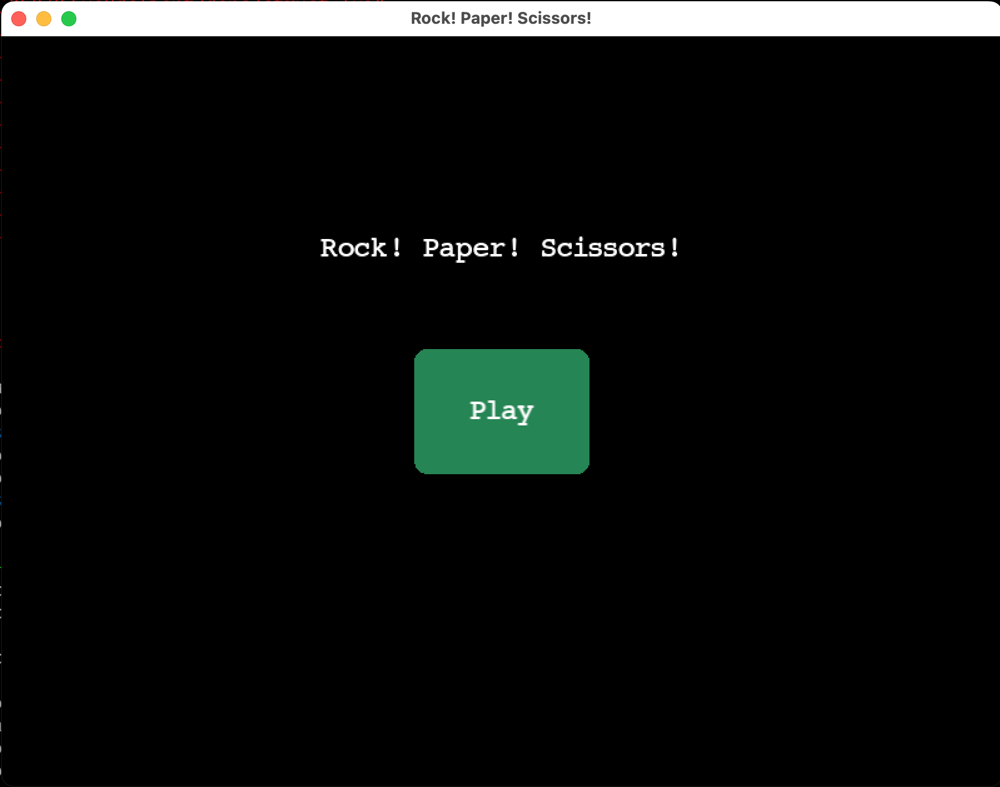
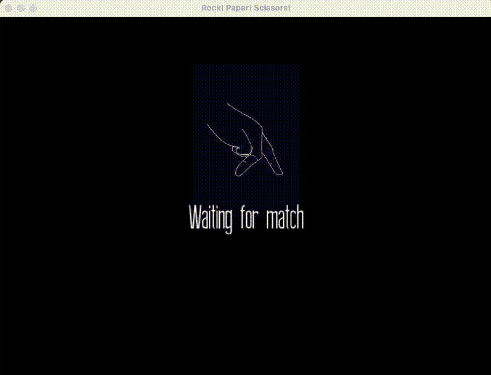
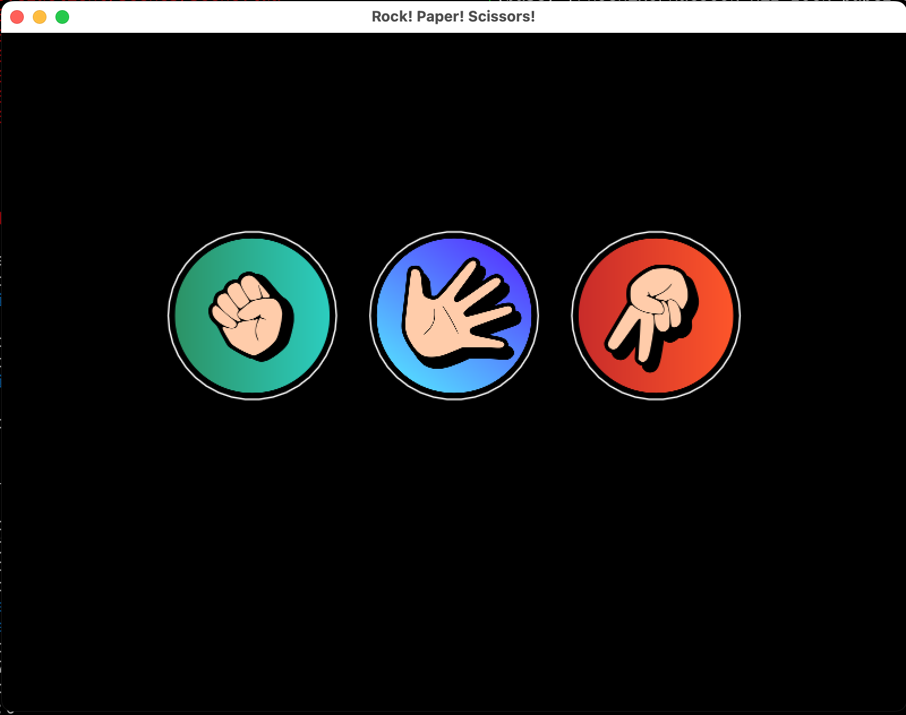

# rock-paper-scissors
Prototype for Game Networking

This project features client and server code for implementing a very simple application that allows
users to play Rock Paper Scissors.

The motivation for this project does not come from the complexity of the game itself, but to
experiment with Löve2d, creating UI elements, and simple networking. Lua, Löve2d, and all of the
included libraries prioritize portability over function, so a custom protocol was designed. The
protocol is primarily a group of signals, but a few signals indicate that there is more data to
follow.

## Communication Protocol

```
# Matchmaking Sequence Diagram:
# Client 1 ->   REQ
#               ACK       <- Server
# ...
# Client 2 ->   REQ
#               ACK       <- Server
# Client 1, 2
#               COMP [match_id] <- Server
MATCHMAKING_REQ = 0b0001
MATCHMAKING_ACK = 0b0010
MATCHMAKING_COMP = 0b0011

# Game Logic Sequence Diagram
# Client 1 -> ROCK [match_id]
# ...
# Client 2 -> PAPER [match_id]
# Client 1
#             PAPER <- Server
# Client 2
#             ROCK <- Server
ROCK, PAPER, SCISSORS = 0b0100, 0b0101, 0b0110

OPPONENT_NOT_CONNECTED = 0b0111
```

Currently, the client and server have only been run on a local machine. So, it's not clear if it
works in a real network environment. Signals are primarily "fire and forget", but there is an ACK
signal for the matchmaking process. The game logic is simple enough that "fire and forget" strategy
may be acceptable, but the matchmaking at least seems incomplete without timeouts. Some research
into the Two General's problem seems to indicate rethinking the implementaion would be a good idea.

Regarding networking, there is no client ID outside of the host address:port combination. As noted
in the source code, this is not a good identifier because the the address and port can be spoofed.
Liberties were taken due to the unserious nature of this prototype.

## Game Scenes





